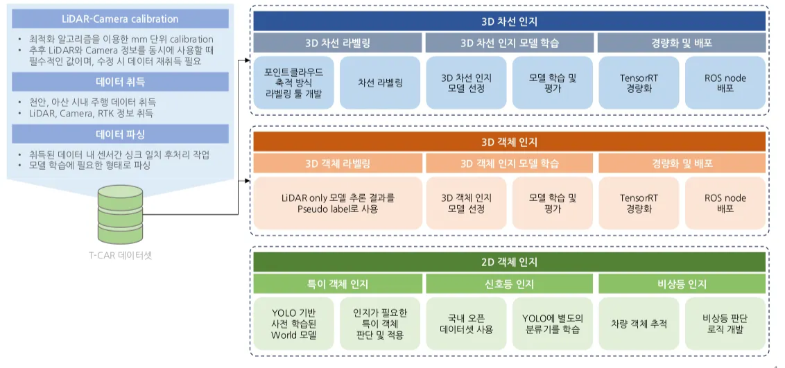

# T-Car: Traffic Light & Sign Detection

## 1. Overview

This repository documents the traffic perception pipeline used in T-CAR experiments.
The detection system is implemented as a 2-stage pipeline:

### Stage 1 – Traffic Object Detection (YOLOv11s)
**Model**: `Yolo11s`  
**Classes**:
- 0: traffic_sign
- 1: traffic_light
**Output**: bounding boxes for traffic signs and traffic lights
<hr>

### Stage 2 – Traffic Light State Classification (MobileNet)
**Model**: `MobileNet` classifier   
**Outpu**t: traffic light signal state (e.g., red / yellow / green)

**This repository focuses on:**   
- Stage 1 model comparison (baseline vs large-scale training)  
- Visualization results  
- Training configuration and reproducibility

## 2. Pipeline Architecture

<p align="center">
  
</p>

``` bash
Input Image
     │
     ▼
[ Stage 1: YOLOv11s ]
Traffic Object Detection
(traffic_sign / traffic_light)
     │
     ├── traffic_sign → (handled separately)
     │
     └── traffic_light bbox
             │
             ▼
[ Crop ROI ]
             │
             ▼
[ Stage 2: MobileNet ]
Traffic Light Signal Classification
(red / yellow / green)
```

## 3. Dataset
### 3.1 천안(Cheonan) T-CAR Sample Dataset
This repository includes a 260-image dataset:
```bash
data/images/
```
--- 
### 3.2 Large-Scale Training Data
The `after.pt` model was trained with:   
~10,000 images (baseline)  
~550,000 additional images (expanded dataset)  

**Total scale**: ~560,000 images

Raw dataset (AIHub-based) is not included in this repository.  
See `train/README.md` for training details.

## 4. Models
Located in:
```bash
weights/
```
### before.pt
- Trained on ~10k images
- Baseline YOLOv11s detector

### after.pt
- Trained with +550k additional images
- Improved robustness and small-object detection

## 5. Visualization Results
Stored in:
```bash
runs/viz/
  ├── before/
  ├── after/
  ├── compare/
  └── compare.mp4
```

- `before/`: detection results using baseline model
- `after/`: detection results using large-scale trained model
- `compare/`: side-by-side merged results (left: before, right: after)
- `compare.mp4`: video comparison

## 6. Training
Training configuration and conversion scripts are located in:
```bash
train/
```
### Includes:
- YOLO dataset conversion script
- data.yaml
- multi-GPU training command  
Refer to `train/README.md` for details.
